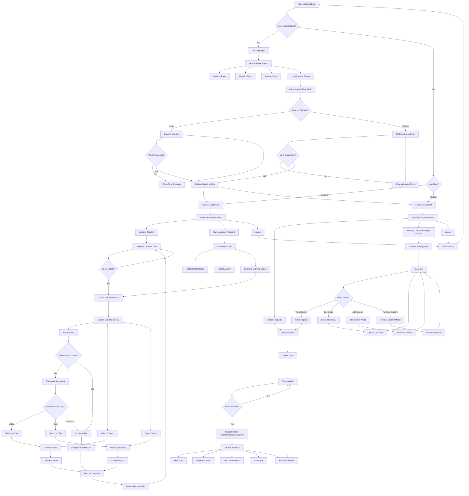

# NeuroVerse User Flowchart

## Overview
NeuroVerse is an AI-powered learning platform that uses real-time brainwave analysis to provide personalized education experiences. The platform supports two main user types: Students and Teachers.

## User Types & Entry Points

### 1. Unauthenticated Users
- **Entry Point**: Landing page (/)
- **Available Actions**: Browse public pages, Login/Register

### 2. Students
- **Entry Point**: After authentication
- **Primary Features**: Lessons, My Lessons, Progress Tracking

### 3. Teachers
- **Entry Point**: After authentication
- **Primary Features**: Reports, Manage Classes, Student Monitoring

---

## Complete User Flow

## Key User Journeys

### Student Journey
1. **Landing** → **Login/Register** → **Student Dashboard**
2. **Browse Lessons** → **Select Lesson** → **Complete Modules** → **Track Progress**
3. **My Lessons** → **Continue Learning** → **Resume Progress**

### Teacher Journey
1. **Landing** → **Login/Register** → **Teacher Dashboard**
2. **Manage Classes** → **Add/Edit Students** → **View Reports**
3. **Reports** → **Select Class** → **Monitor Students** → **View Analytics**

### Adaptive Learning Features
- **Real-time EEG Monitoring**: Tracks student attention levels
- **Content Switching**: Automatically suggests video/quiz when attention drops
- **Progress Tracking**: Monitors completion rates and performance
- **AI Analysis**: Provides insights on learning patterns

## Decision Points

### Authentication
- **Login vs Register**: Users can choose to sign in or create new account
- **Role Selection**: Choose between Student or Teacher role
- **Validation**: Form validation and credential checking

### Content Navigation
- **Module Selection**: Students can navigate between different lesson modules
- **Content Type**: Switch between text, video, and quiz content
- **Adaptive Suggestions**: System suggests content changes based on attention

### Teacher Management
- **Class Selection**: Teachers can switch between different classes
- **Student Selection**: Choose specific students to monitor
- **Action Selection**: View reports, edit classes, or manage students

## Error Handling
- **Invalid Credentials**: Return to login with error message
- **Validation Errors**: Show specific field errors during registration
- **Access Control**: Redirect unauthorized users to appropriate pages
- **Missing Content**: Handle cases where lessons or students don't exist

## Success Paths
- **Lesson Completion**: Students can mark lessons as complete
- **Progress Tracking**: System tracks and displays learning progress
- **Analytics**: Teachers can view detailed student performance data
- **Session Management**: Users can logout and return to landing page 